  

# Critical-Minerals

### 📊 Silver, Copper, Lithium & Nickel Resource Profiles

| Metric | 🥈 Silver Sector | 🥉 Copper Sector | 🔋 Lithium Sector | ⚙️ Nickel Sector |
| :--- | :--- | :--- | :--- | :--- |
| **Chile: Total Reserves** | 26,000 Metric Tons | ~190,000,000 MT *(19% of global share)* | 9,300,000 MT *(Top brine reserves)* | Negligible / Not tracked |
| **Chile: Total Mined (Annual)** | ~1,400 Metric Tons | ~5,000,000+ Metric Tons | ~41,400 Metric Tons | Negligible |
| **Peru: Total Reserves** | 140,000 Metric Tons | ~120,000,000 MT *(12% of global share)* | Negligible | Negligible |
| **Peru: Total Mined (Annual)** | ~3,100 Metric Tons | ~2,600,000+ Metric Tons | Negligible | Negligible |
| **Australia: Total Reserves** | ~92,000 Metric Tons | ~100,000,000 Metric Tons | ~6,200,000 MT *(Top hard-rock)* | ~6,700,000 Metric Tons |
| **Australia: Total Mined (Annual)** | ~1,200 Metric Tons | ~810,000 Metric Tons | **~86,000+ Metric Tons** | ~170,000 Metric Tons |
| **Bolivia: Total Reserves** | ~22,000 Metric Tons | Negligible | **23,000,000 MT** *(Resources)* | Negligible |
| **Bolivia: Total Mined (Annual)** | ~1,200 Metric Tons | Negligible | Minimal *(Early stage)* | Negligible |
| **Indonesia: Total Reserves** | Negligible | ~24,000,000 Metric Tons | Negligible | **~55,000,000 MT** *(Global Reserve Leader)* |
| **Indonesia: Total Mined (Annual)** | Negligible | ~900,000+ Metric Tons | Negligible | **~1,800,000+ MT** *(Global Production Leader)* |
| **Global Production Leader** | **Mexico** (~6,400 MT) | **Chile** (~5,000,000+ MT) | **Australia** (~86,000+ MT) | **Indonesia** (~1,800,000+ MT) |
| **Global Reserve Leader** | **Peru** *(22% global share)* | **Chile** (~190,000,000 MT) | **Bolivia** *(Resources)* / **Chile** *(Reserves)* | **Indonesia** (~55,000,000 MT) |

---

### 🧲 Rare Earth Metals (REE) Resource Profiles

| Metric | 🧲 Total Rare Earths (REO) | ⚡ Light REEs (LREE: Nd, Pr, La, Ce) | 🌌 Heavy REEs (HREE: Dy, Tb, Y) |
| :--- | :--- | :--- | :--- |
| **China: Total Reserves** | **44,000,000 MT** *(~38% global share)* | Dominant *(Bayan Obo deposit)* | **Dominant** *(Southern ionic clays)* |
| **China: Total Mined (Annual)** | **~240,000 MT** *(~68% global production)* | **~205,000 Metric Tons** | **~35,000 Metric Tons** |
| **United States: Total Reserves** | ~2,300,000 Metric Tons | ~2,200,000 MT *(Mountain Pass bastnäsite)* | Trace / Minor |
| **United States: Total Mined (Annual)** | ~43,000 Metric Tons | ~43,000 Metric Tons | Minimal |
| **Australia: Total Reserves** | ~4,200,000 Metric Tons | ~3,800,000 MT *(Mt Weld monazite)* | ~400,000 MT *(Mt Weld / Browns Range)* |
| **Australia: Total Mined (Annual)** | ~18,000 Metric Tons | ~17,000 Metric Tons | ~1,000 Metric Tons |
| **Myanmar: Total Reserves** | ~40,000 Metric Tons | Negligible | Critical Global Source *(Ionic clay mines)* |
| **Myanmar: Total Mined (Annual)** | ~38,000 Metric Tons | Minor | **~30,000+ Metric Tons** |
| **Vietnam: Total Reserves** | **~22,000,000 MT** *(2nd globally)* | High potential *(Nam Xe / Dong Pao)* | Untapped potential |
| **Vietnam: Total Mined (Annual)** | ~600 Metric Tons *(Scaling)* | ~600 Metric Tons | Minimal |
| **Brazil: Total Reserves** | **~21,000,000 MT** *(3rd globally)* | High *(Araxá & hard rock)* | Significant *(Ionic clay deposits)* |
| **Brazil: Total Mined (Annual)** | ~80 Metric Tons | ~80 Metric Tons | Negligible |
| **India: Total Reserves** | ~6,900,000 Metric Tons | Beach sand monazite deposits *(IREL)* | Minor |
| **India: Total Mined (Annual)** | ~2,900 Metric Tons | ~2,900 Metric Tons | Negligible |
| **Global Production Leader** | **China** (~68% mine, ~90% refining) | **China** (~70% of global LREE) | **China & Myanmar** (~90%+ of global HREE) |
| **Global Reserve Leader** | **China** (44,000,000 MT REO) | **China** (Bayan Obo, Inner Mongolia) | **China** (Jiangxi, Guangdong ionic clays) |
